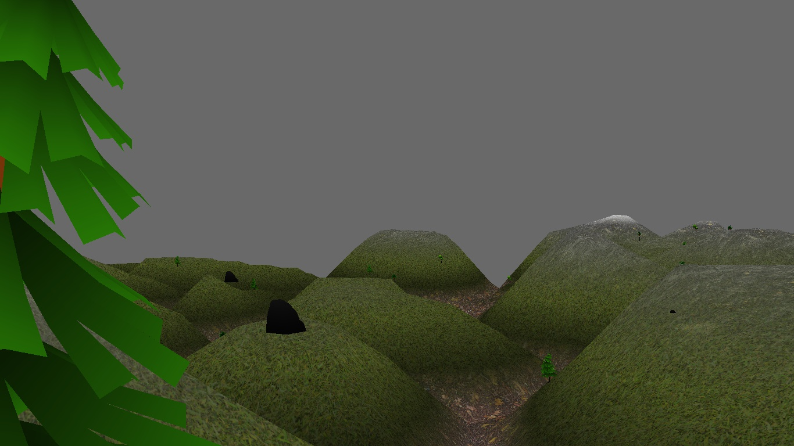

# Panda3dTerrainGenerator
A terrain generator for panda3d

# Installation

## Submodule(mapmaker)
```
git submodule init
git submodule update
```

cd into mapmaker's folder and follow the instructions in the README

## Python deps
```
pip install -r requirements.txt
```

## Generate stuff
For the time being, only two textures are supported(a base texture and a second one which will be applied according with height). Refer to the TestTerrainGenerator.py file for an example

## Screenshots

