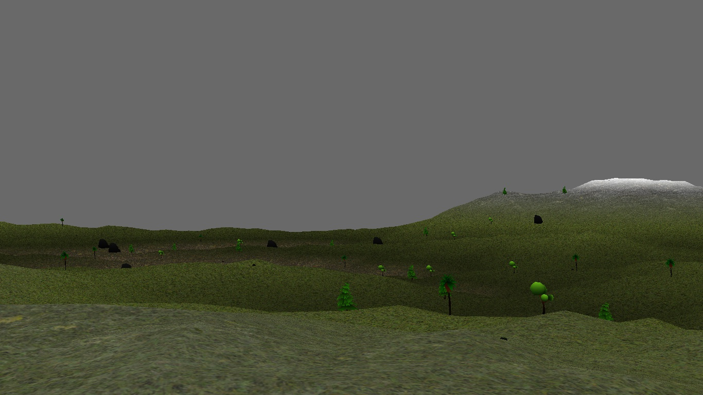

# Panda3dTerrainGenerator
A terrain generator for panda3d

# Installation

## Submodule(mapmaker)
```
git submodule init
git submodule update
```

cd into mapmaker's folder and follow the instructions in the README

## Python deps
```
pip install -r requirements.txt
```

## Generate stuff
The module define two functions
```python
def generateTerrain(shape, #a 2-tuple
                    texture_paths, #an array of paths
                    texture_scale_factors, #an array of integers
                    nature_path, #a path to the folder which contains the 
                                 #natural objects to be placed randomly
                    natural_objects_count, #the number of natural objects
                                           #that you want to be placed
                    path, #a path to the folder which will contain the generated data
                    force=False #if force==True, it will delete the folder 
                                #indicated by path(if it already exists)
                    )
```

```python
#this will return the GeoMipTerrain object and the corresponding NodePath 
def loadTerrain(path #the path specified with the previous method
                )
```

For the time being, only 3 textures are supported and should be provided in the following order:

    1. Base texture(e.g. grass)

    2. Height-dependant texture(e.g. snow)

    3. Slope-dependant texture(e.g. rock)
Refer to the TestTerrainGenerator.py file for an example

## Screenshots



## Credits
["Low poly Stylized Nature Pack"](https://skfb.ly/6VZTt) by Satendra Saraswat is licensed under [Creative Commons Attribution](http://creativecommons.org/licenses/by/4.0/).
